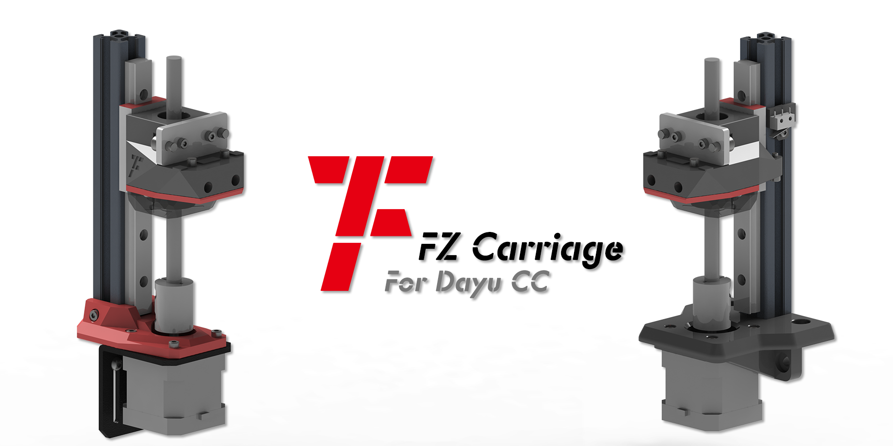

<h1 align="center">FZ Carriage CC</h1>

**
给大鱼CC 3D打印机设计的一款双Z轴方案**

[Designs of the dual Z-axis for the DaYu CC 3D parinter]

 ---
 
 
 
 ---

## 主要功能
> - [x] BLV式Z轴
> - [x] 推力球轴承式解耦
> - [x] 限位快速微调

## 更新历史
> **[Ver 1.1]** 2022.10.01

## 备注
- 步进电机支架有两种方案
  - 商品标准件支架+打印导向块
  - [**Voron Trident 1.9**](https://github.com/VoronDesign/Voron-Trident) Z电机支架

- 推力球轴承式解耦灵感来源 B站up主 **`“一只画风独特的Aouk”`** [>视频链接<](https://www.bilibili.com/video/BV1DZ4y1y7JN/)
