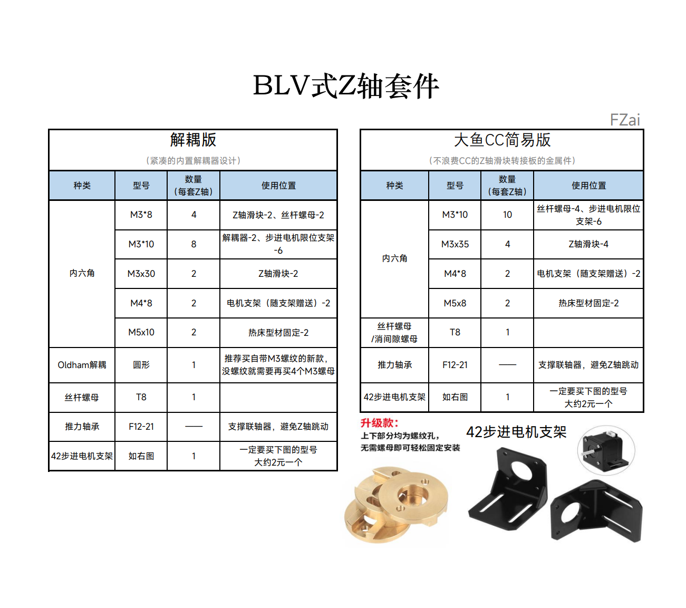

<h1 align="center">FZ Z-Carriage</h1>

**
3D打印机双Z轴改装方案
**

[Designs of the dual Z-axis for 3D parinter]

 ---
 
 CC简易版(下).png)
 
 ---

## 主要功能
### 通用解耦版
> - [x] BLV式Z轴
> - [x] Oldham解耦
> - [x] 限位快速微调（Z轴双限位时可用）

### 大鱼CC版
> - [x] 大鱼CC专用
> - [x] BLV式Z轴
> - [x] 支持消隙丝杆螺母
> - [x] 限位快速微调（Z轴双限位时可用）

## 备注
   **步进电机支架有两种方案**
 >  <<< **商品金属标准件支架**   *>>>或者是<<<*   **打印件** [*Voron Trident的Z电机支架*](https://github.com/VoronDesign/Voron-Trident) >>>

## BOM 物料清单

## 更新历史
> **[Ver 1.0]** 2023.07.02

